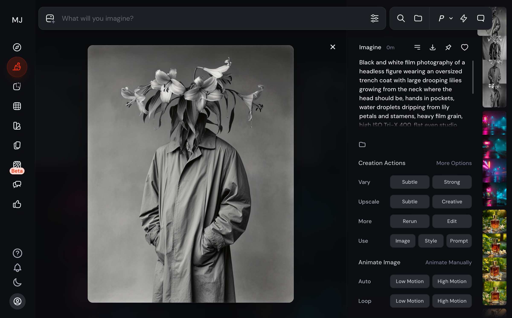
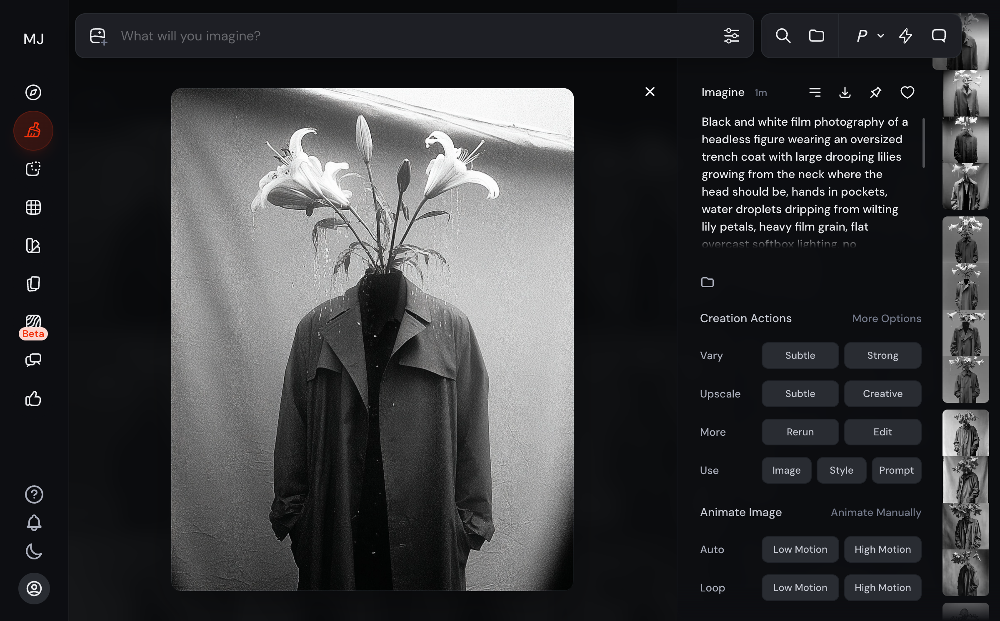
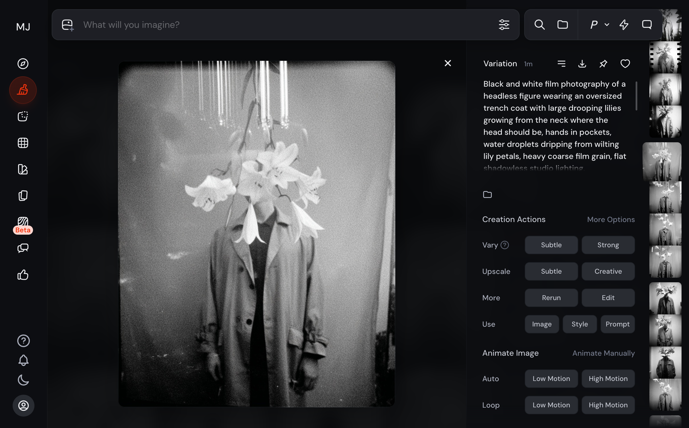

# Midjourney Prompt Learning System

A Claude Code skill that iterates on Midjourney prompts, scores results on 7 dimensions, and builds a knowledge base of what actually works. Each session feeds a learning loop — patterns are extracted from successes and failures, keywords are ranked by effectiveness, and failure modes are cataloged. Over time, first-attempt quality improves as the system applies accumulated craft knowledge.

> **15 sessions, 79 iterations, 88 patterns, 106 tracked keywords** — and growing.

## See It In Action

### Surreal B&W Film Portrait — Tradeoff Discovery

**Goal:** A surreal headless figure with lilies growing from the neck, heavy B&W film grain, flat even lighting on a seamless gray backdrop. Match a specific reference photo's grain character and deadpan mood. Target: 0.93 score.

| Reference | Iteration 1 (0.85) | Iteration 4 — Peak (0.90) | Iteration 9 — Grain Breakthrough |
|:-:|:-:|:-:|:-:|
|  |  |  |  |

#### Setup decisions

The system analyzed the reference image and made three upfront choices before generating anything:

1. **Hybrid approach** — Use `--sref` with the reference for grain/mood transfer (hard to describe in words) while prompting explicitly for the surreal subject (headless figure, lilies). Log which aspects come from sref vs. prompt so reflection can learn from both.
2. **Second sref for grain** — The reference's film grain was the hardest quality to reproduce. The system found a dedicated grain reference photo and blended it as a weighted secondary sref (`grain::2 flower::1`), targeting the specific dimension where prompt keywords have the weakest control.
3. **Knowledge application** — Queried 88 patterns before writing the prompt. Applied "front-load critical details" (V7 weights prompt beginning), checked keyword effectiveness for B&W film descriptors, and avoided known failure modes like "clean" + "sharp" co-occurring with film grain intent.

#### What happened: 15 iterations across 6 approaches

**Rapid convergence (iter 1-4).** The knowledge-informed first prompt scored 0.85 — subject, mood, and color were strong immediately. Three iterations of prompt refinement (adding "flat overcast softbox lighting," expanding the `--no` list) pushed the best image to **0.90** by iteration 4. The system recommended Vary Subtle to polish rather than prompt edit, following the "fragile equilibria above 0.80" pattern.

**Pushing for 0.93 revealed a fundamental tradeoff.** Grain and lighting couldn't be maximized simultaneously — they pulled in opposite directions:

| Approach | Iters | Best Score | Grain | Lighting | What It Proved |
|----------|-------|-----------|-------|----------|---------------|
| Balanced (prompt + dual sref) | 1-4 | **0.90** | 0.85 | 0.84 | Best overall, but neither dimension maxed |
| Vary Subtle | 5, 7, 10 | 0.887 | 0.87 | 0.80 | Maintains structure, regresses lighting |
| Grain-only sref | 9 | 0.879 | **0.93** | 0.74 | Grain breakthrough — but too dark |
| Flat lighting prompt | 8 | 0.884 | 0.82 | **0.88** | Lighting +0.06 — but grain drops |
| `--raw` toggle | 12 | 0.871 | 0.84 | 0.85 | Confirmed: raw = grain + dark |
| **Editor inpainting** | 13 | 0.860 | 0.86 | 0.79 | New approach — see below |

**Key pivot (iter 8):** Adding "flat shadowless studio lighting" + "completely even soft illumination" and putting `dramatic lighting, side lighting, rim light` in `--no` improved lighting by **+0.06** — the single biggest dimension jump in the session. But the grain sref fought back: it transfers dark, contrasty lighting alongside the grain texture.

#### Editor inpainting — a new tool

After exhausting prompt-level approaches, the system tried MJ's built-in editor to selectively regenerate only the background while preserving the figure's grain:

| Editor mask (background erased) | Editor result (iter 13) |
|:-:|:-:|
|  |  |

Smart Select segmented the background cleanly. The prompt was updated to emphasize flat gray backdrop with `--raw` and `--sw` removed. But the regenerated background introduced **walls and corners** instead of flat gray — the preserved figure implied a physical space, so MJ filled in environmental context. A new failure mode was discovered and cataloged.

#### Patterns extracted

The session produced 3 new patterns added to the database:

- **`--raw` = grain vs. lighting toggle** (medium confidence, 3 A/B tests): `--style raw` increases grain fidelity but darkens the image. No single-prompt solution exists for maximizing both.
- **Editor environmental intrusion** (low confidence, 1 test): MJ's inpainting adds walls/surfaces when regenerating backgrounds around a preserved figure, even when the prompt says "seamless backdrop."
- **Editor grain mismatch** (low confidence, 1 test): Regenerated areas have different grain character than sref-assisted preserved areas, creating a visible texture split.

**Final result:** Session closed at **0.90** (iter 4, img-1). The 0.93 target was identified as unreachable with current techniques — the grain-vs-lighting tradeoff is a real ceiling for this subject/reference combination, not a prompt problem to solve. That honest identification is itself valuable: future sessions with similar tradeoffs can skip 10 iterations of dead ends.

---

## What It Learns

Real numbers from the database after 15 sessions:

| What | Count | How It's Used |
|------|-------|---------------|
| **Patterns** | 88 across 12 categories | Applied to new prompts before generation. Each has a problem/solution pair with evidence chain |
| **Keywords** | 106 tracked | Ranked by effectiveness. Bad keywords actively avoided |
| **Failure modes** | 16 cataloged | Diagnostic trees organized by scoring dimension. System checks for known traps before constructing prompts |
| **Action decisions** | 79 logged | Which action (Vary, prompt edit, sref, editor) works best for which gap type |

<details>
<summary>Example pattern card (from database)</summary>

```
Pattern: raw-grain-lighting-tradeoff
Category: technique | Confidence: medium | Success rate: 33% (1/3)

Problem: Need both heavy film grain and flat even lighting in the same image.
         --style raw increases grain but darkens. Removing raw brightens but
         reduces grain.

Solution: Accept the balanced result (with --raw at moderate sref weight)
          rather than trying to maximize both. Alternatively, use editor edit
          to fix lighting regionally, accepting some texture mismatch.

Evidence: Session 17bbeab3 — 3 A/B comparisons across iter 9-14.
          raw+grain sref: grain 0.93, lighting 0.74
          no raw: grain 0.84, lighting 0.85
          balanced: grain 0.85, lighting 0.84 (best overall at 0.90)
```

</details>

## How It Works

```
You describe what you want
  → System queries 88 patterns + 106 keywords for relevant knowledge
    → Constructs an informed prompt (applying known good keywords, avoiding known bad ones)
      → Submits to Midjourney via browser automation (or you paste manually)
        → Scores the output on 7 dimensions (subject, lighting, color, mood, composition, material, spatial)
          → Gap analysis determines: Vary Subtle, Vary Strong, prompt rewrite, sref, or editor edit?
            → Patterns extracted from what worked and what didn't
              → Knowledge compounds across sessions
```

Scoring uses 7 standard dimensions evaluated against the reference image or session intent. All 7 are always scored (1.0 for "not applicable") to ensure cross-session comparability. Scores are presented as preliminary and validated with the user — the system knows its spatial relationship assessment can be unreliable.

## Getting Started

### Level 1: Core Only (no setup)

The `core-*` rules work standalone — reference analysis, prompt construction, scoring, and iteration strategy. Copy prompts to Midjourney manually.

### Level 2: Core + Learning

Add persistent pattern tracking across sessions.

```bash
# Install the sqlite MCP server
claude mcp add sqlite-simple -- npx @anthropic-ai/sqlite-simple-mcp mydatabase.db

# Initialize the database
sqlite3 mydatabase.db < schema.sql
```

### Level 3: Full Automation

Add browser control for hands-free iteration. The system submits prompts to midjourney.com, waits for generation, captures all 4 images, scores them, and recommends the next action.

```bash
# Add the playwright MCP server
claude mcp add playwright -- npx @playwright/mcp@latest --headed
```

Log in manually on first use — cookies persist after that.

### Prerequisites

- [Claude Code](https://docs.anthropic.com/en/docs/claude-code) CLI
- A Midjourney subscription
- Node.js (for MCP servers, Level 2+)
- SQLite3 CLI (for database setup, Level 2+)

## Commands

| Command | Purpose |
|---------|---------|
| `/new-session` | Start a new session with full knowledge application |
| `/log-iteration` | Log a generation attempt with scoring and gap analysis |
| `/reflect` | Cross-session pattern analysis and knowledge extraction |
| `/research [focus]` | Research community techniques for a specific challenge |
| `/show-knowledge [category]` | Display learned patterns |
| `/apply-knowledge <desc>` | Get pattern-informed prompt for a description |
| `/discover-styles` | Browse and catalog MJ style codes from the Style Explorer |
| `/validate-pattern [id]` | Mark a pattern as validated or contradicted |
| `/forget-pattern [id]` | Deactivate a pattern |

## Architecture

Compatible with the [Vercel agent-skills](https://github.com/vercel/agent-skills) format.

<details>
<summary>Repository structure</summary>

```
.
├── SKILL.md                     # Skill definition and entry point
├── CLAUDE.md                    # Claude Code router
├── AGENTS.md                    # Compiled full reference (auto-generated from rules/)
├── schema.sql                   # Database setup (6 tables)
├── rules/
│   ├── core-reference-analysis.md   # 7-element visual framework
│   ├── core-prompt-construction.md  # V7 prompt structure, keyword practices
│   ├── core-research-phase.md       # Coverage assessment, community research
│   ├── core-assessment-scoring.md   # 7-dimension scoring guide
│   ├── core-iteration-framework.md  # Gap analysis, action decisions
│   ├── learn-data-model.md          # Database schema, session structure
│   ├── learn-pattern-lifecycle.md   # Confidence graduation, decay
│   ├── learn-reflection.md          # Session lifecycle, contrastive analysis
│   ├── auto-core-workflows.md       # Browser automation sequences
│   └── auto-reference-patterns.md   # Selector strategy, error handling
├── knowledge/
│   ├── v7-parameters.md         # MJ V7 parameter reference (static)
│   ├── translation-tables.md    # Visual quality → MJ keyword mappings (static)
│   ├── failure-modes.md         # Diagnostic framework + session-learned failures
│   ├── learned-patterns.md      # Auto-generated pattern summaries
│   └── keyword-effectiveness.md # Auto-generated keyword ratings
├── scripts/build.sh             # Compiles rules/ → AGENTS.md
└── .claude/commands/            # Slash command definitions
```

</details>

<details>
<summary>Rule categories</summary>

| Section | Impact | Prefix | Rules | Dependencies |
|---------|--------|--------|-------|-------------|
| **Core Prompt Engineering** | CRITICAL | `core-` | 5 | None — works standalone |
| **Learning & Reflection** | HIGH | `learn-` | 3 | sqlite MCP server |
| **Browser Automation** | MEDIUM | `auto-` | 2 | playwright MCP server |

</details>

<details>
<summary>Knowledge files</summary>

**Static** (ships with content): `v7-parameters.md`, `translation-tables.md`, `prompt-templates/`, `official-docs.md`

**Dynamic** (populated through use): `learned-patterns.md`, `keyword-effectiveness.md`, `failure-modes.md` (bottom section)

</details>

<details>
<summary>Building AGENTS.md</summary>

```bash
./scripts/build.sh
```

Strips YAML frontmatter from each rule file and concatenates them under section headers.

</details>

## License

MIT
