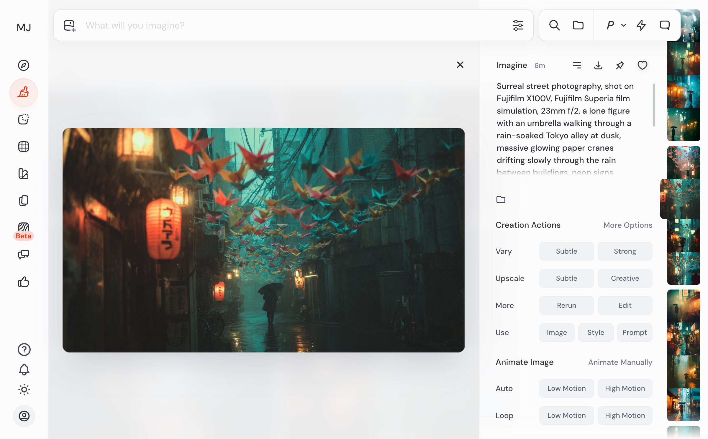
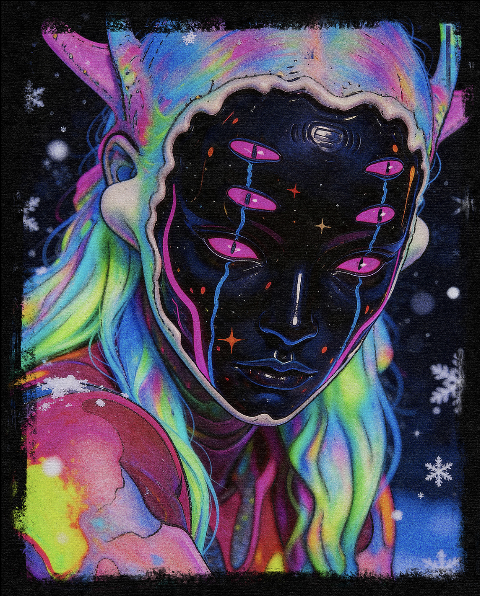
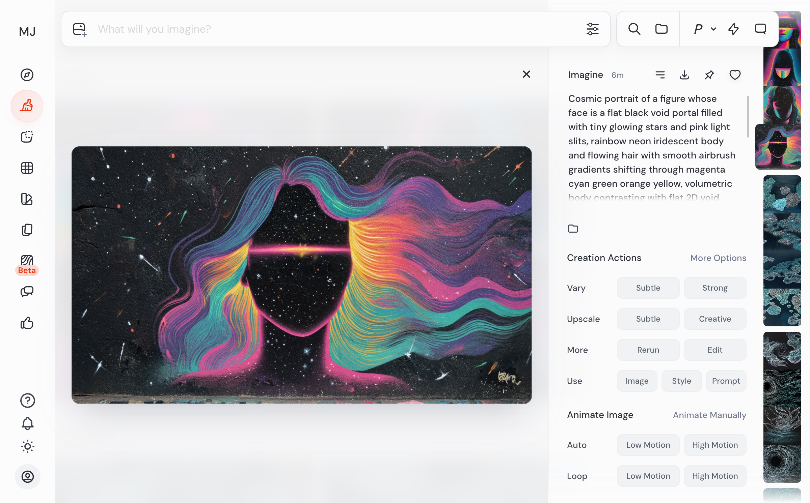
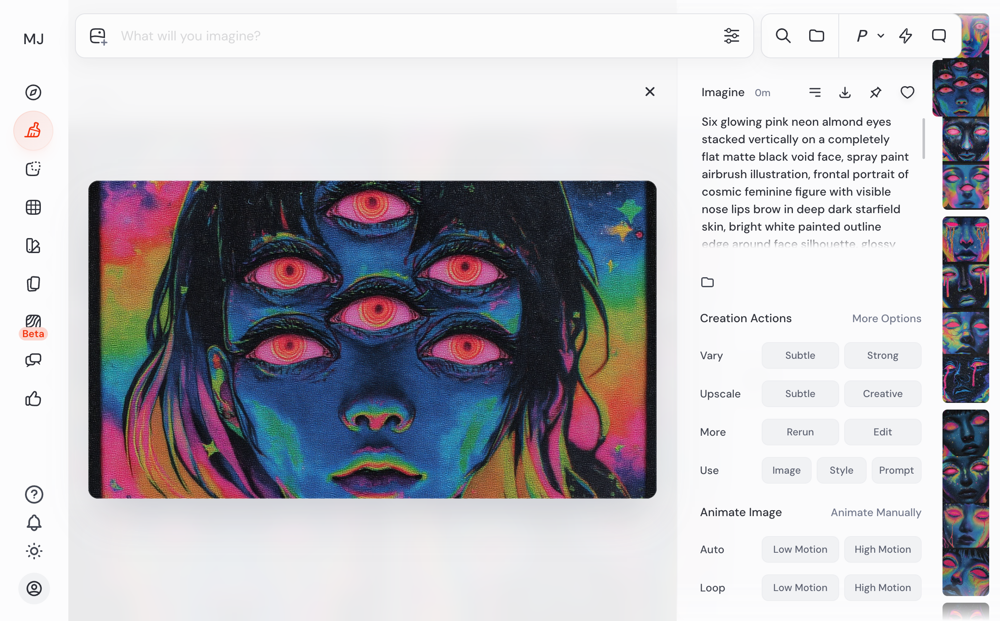
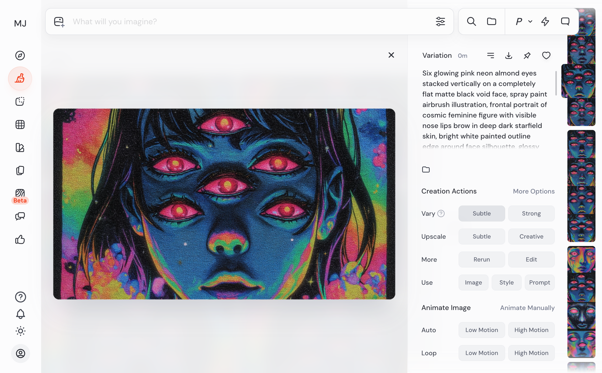
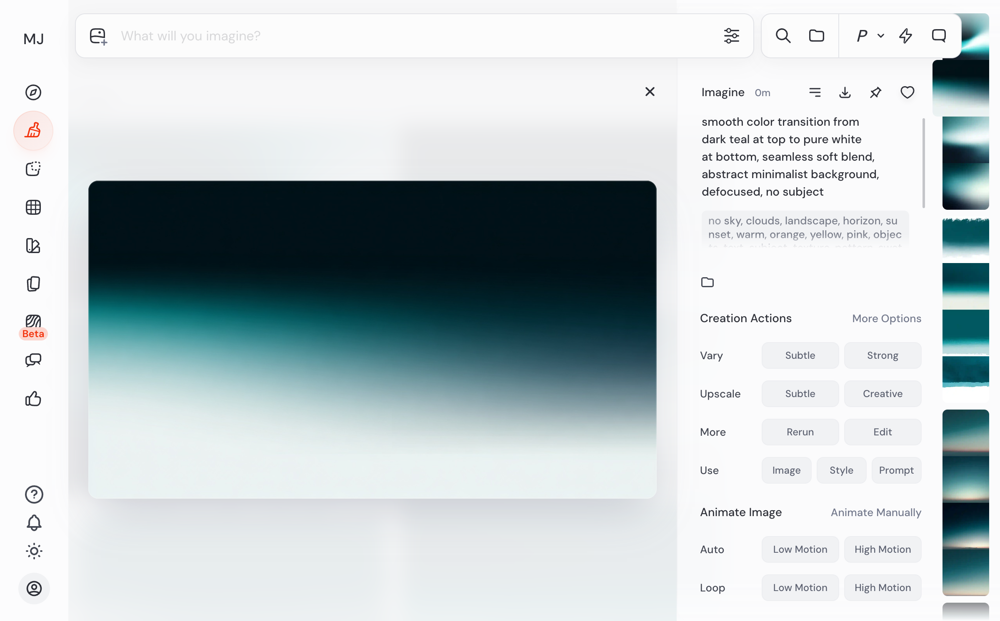

# Midjourney Prompt Learning System

A Claude Code skill that iterates on Midjourney prompts, scores results on 7 dimensions, and builds a knowledge base of what actually works. Each session feeds a learning loop — patterns are extracted from successes and failures, keywords are ranked by effectiveness, and failure modes are cataloged. Over time, first-attempt quality improves as the system applies accumulated craft knowledge.

> **13 sessions, 64 iterations, 82 patterns, 106 tracked keywords** — and growing.

## See It In Action

### Surreal Fujifilm Street Photography

**Goal:** Surreal street photography with authentic Fujifilm film simulation color science — but MJ kept ignoring the surreal elements.

| Iteration 1 (0.87 avg) | Iteration 3 — Whale (0.90) | Iteration 6 — Paper Cranes (0.92) |
|:-:|:-:|:-:|
|  |  |  |

**What happened:** Iteration 1 nailed the Fujifilm Superia color science (teal shadows, amber highlights, organic grain) — but produced zero surrealism. "Impossible reflections" and "surreal" were treated as mood words, not visual instructions. The system diagnosed this as a prompt-level issue: abstract modifiers get ignored when concrete subject keywords dominate.

**Key pivot (iter 2 → 3):** Replaced abstract surreal modifiers with a single concrete impossible element — "a massive whale silhouette swimming through the fog above the rooftops." Score jumped +0.03 while fully restoring the photorealistic Fujifilm base that "double exposure" had degraded in iter 2.

**Pattern extracted:** *Concrete impossible elements > abstract surreal modifiers.* MJ renders a specific impossible object (whale, floating cranes, koi fish) reliably, but ignores mood-level words like "surreal" or "impossible reflections." This pattern now applies to all future sessions involving surrealism.

---

### XSULLO "Hibernal" Cosmic Portrait

**Goal:** Recreate an XSULLO painting — cosmic void face with multiple eyes, rainbow iridescent spray-paint body. The hard part: achieving sharp 2D/3D material contrast between a flat void face and a volumetric body.

| Reference | Iteration 1 (0.75 avg) | Iteration 14 — Breakthrough (0.82) | Iteration 16 — Final (0.86) |
|:-:|:-:|:-:|:-:|
|  |  |  |  |

**What happened:** 16 iterations across two phases. Prompt-only edits (iter 1-11) hit a ceiling at ~0.80 — the material contrast gap persisted through 8 different vocabulary approaches. "White outline edge" and "sharp cutout" didn't create visible separation. Adding `--sref` with the reference image at `--sw 200` (iter 12+) finally pulled structural features, not just style.

**Key pivot (iter 13 → 14):** Changed "eye-slits arranged down" to "almond eyes stacked vertically." MJ had been interpreting "slits" as tear drips. "Almond" produced actual eye shapes. Combined with `--sw 200`, this cracked the multi-eye barrier — image 2 showed 5-6 vertical pink eyes matching the reference.

**Patterns extracted:**
- *"Almond eyes stacked vertically" >> "eye-slits arranged down"* — MJ's vocabulary interpretation matters more than your intent
- *--sw 200 pulls structural features from sref* — default 100 transfers only color/style, 200 also influences composition
- *Opposing material adjectives create contrast* — "flat matte black" vs "glossy luminous rainbow" produces visible 2D/3D contrast; generic "outline edge" doesn't
- *Vary Subtle preserves structural breakthroughs* — multi-eye survived 2 rounds of Vary Subtle without regression

---

### Minimal Teal Gradient

**Goal:** A clean vertical gradient from deep teal to white. No subject, no texture. Sounds simple — it wasn't.

| Reference | Iteration 1 (0.82 avg) | Iteration 4 — Sky Metaphor | Iteration 6 — Final |
|:-:|:-:|:-:|:-:|
|  |  |  |  |

**What happened:** MJ defaulted to horizontal gradients, added bokeh spots, and resisted directional control. Ultra-minimal prompts (iter 3: just "dark teal to white gradient, vertical, top to bottom") improved direction but "vertical" triggered stripe patterns in 1 of 4 images. The sky metaphor (iter 4: "clear dusk sky, deep muted teal zenith") produced the smoothest transitions — but injected warm sunset glow at the bottom.

**Failure modes discovered:**
- "Color swatch" + "wash" → MJ renders watercolor paint on paper, not a digital gradient
- "Defocused" → triggers lens glow/aurora effects instead of smoothing
- "Vertical" as standalone word → can trigger vertical stripe/bar patterns
- Sky/horizon metaphors → inject warm sunset colors regardless of `--no` list

**Pattern extracted:** *Sky metaphors produce the smoothest gradients but contaminate the color palette.* For pure color control, use "smooth color transition from [color] at top to [color] at bottom" with explicit `--no` for warm colors.

---

## What It Learns

Real numbers from the database after 13 sessions:

| What | Count | How It's Used |
|------|-------|---------------|
| **Patterns** | 82 across 11 categories | Applied to new prompts before generation. Each has a problem/solution pair with evidence chain |
| **Keywords** | 106 tracked | Ranked by effectiveness (36 excellent, 31 good, 11 poor, 21 counterproductive). Bad keywords actively avoided |
| **Failure modes** | 13 cataloged | Diagnostic trees organized by scoring dimension. System checks for known traps before constructing prompts |
| **High-confidence patterns** | 4 graduated | Tested 5+ times with 100% success rate. These are applied with highest priority |

<details>
<summary>Example pattern card (from database)</summary>

```
Pattern: vary-subtle-structural-stability
Category: workflow | Confidence: high | Success rate: 100% (2/2)

Problem: Need to polish high-scoring structural breakthrough without losing
         the structural feature

Solution: Vary Subtle preserves structural breakthroughs (like multi-eye)
          across multiple rounds. Multi-eye remained stable across 2 rounds
          of Vary Subtle (iter 14→15→16). Safe to use for polishing.

Evidence: Session bf0036e5 — iter 14 (0.84) → Vary Subtle → iter 15 (0.845)
          → Vary Subtle → iter 16 (0.855)
```

</details>

## How It Works

```
You describe what you want
  → System queries 82 patterns + 106 keywords for relevant knowledge
    → Constructs an informed prompt (applying known good keywords, avoiding known bad ones)
      → Submits to Midjourney via browser automation (or you paste manually)
        → Scores the output on 7 dimensions (subject, lighting, color, mood, composition, material, spatial)
          → Gap analysis determines: Vary Subtle, Vary Strong, or prompt rewrite?
            → Patterns extracted from what worked and what didn't
              → Knowledge compounds across sessions
```

Scoring uses 7 standard dimensions evaluated against the reference image or session intent. All 7 are always scored (1.0 for "not applicable") to ensure cross-session comparability. Scores are presented as preliminary and validated with the user — the system knows its spatial relationship assessment can be unreliable.

## Getting Started

### Level 1: Core Only (no setup)

The `core-*` rules work standalone — reference analysis, prompt construction, scoring, and iteration strategy. Copy prompts to Midjourney manually.

### Level 2: Core + Learning

Add persistent pattern tracking across sessions.

```bash
# Install the sqlite MCP server
claude mcp add sqlite-simple -- npx @anthropic-ai/sqlite-simple-mcp mydatabase.db

# Initialize the database
sqlite3 mydatabase.db < schema.sql
```

### Level 3: Full Automation

Add browser control for hands-free iteration. The system submits prompts to midjourney.com, waits for generation, captures all 4 images, scores them, and recommends the next action.

```bash
# Add the playwright MCP server
claude mcp add playwright -- npx @playwright/mcp@latest --headed
```

Log in manually on first use — cookies persist after that.

### Prerequisites

- [Claude Code](https://docs.anthropic.com/en/docs/claude-code) CLI
- A Midjourney subscription
- Node.js (for MCP servers, Level 2+)
- SQLite3 CLI (for database setup, Level 2+)

## Commands

| Command | Purpose |
|---------|---------|
| `/new-session` | Start a new session with full knowledge application |
| `/log-iteration` | Log a generation attempt with scoring and gap analysis |
| `/reflect` | Cross-session pattern analysis and knowledge extraction |
| `/research [focus]` | Research community techniques for a specific challenge |
| `/show-knowledge [category]` | Display learned patterns |
| `/apply-knowledge <desc>` | Get pattern-informed prompt for a description |
| `/discover-styles` | Browse and catalog MJ style codes from the Style Explorer |
| `/validate-pattern [id]` | Mark a pattern as validated or contradicted |
| `/forget-pattern [id]` | Deactivate a pattern |

## Architecture

Compatible with the [Vercel agent-skills](https://github.com/vercel/agent-skills) format.

<details>
<summary>Repository structure</summary>

```
.
├── SKILL.md                     # Skill definition and entry point
├── CLAUDE.md                    # Claude Code router
├── AGENTS.md                    # Compiled full reference (auto-generated from rules/)
├── schema.sql                   # Database setup (6 tables)
├── rules/
│   ├── core-reference-analysis.md   # 7-element visual framework
│   ├── core-prompt-construction.md  # V7 prompt structure, keyword practices
│   ├── core-research-phase.md       # Coverage assessment, community research
│   ├── core-assessment-scoring.md   # 7-dimension scoring guide
│   ├── core-iteration-framework.md  # Gap analysis, action decisions
│   ├── learn-data-model.md          # Database schema, session structure
│   ├── learn-pattern-lifecycle.md   # Confidence graduation, decay
│   ├── learn-reflection.md          # Session lifecycle, contrastive analysis
│   ├── auto-core-workflows.md       # Browser automation sequences
│   └── auto-reference-patterns.md   # Selector strategy, error handling
├── knowledge/
│   ├── v7-parameters.md         # MJ V7 parameter reference (static)
│   ├── translation-tables.md    # Visual quality → MJ keyword mappings (static)
│   ├── failure-modes.md         # Diagnostic framework + session-learned failures
│   ├── learned-patterns.md      # Auto-generated pattern summaries
│   └── keyword-effectiveness.md # Auto-generated keyword ratings
├── scripts/build.sh             # Compiles rules/ → AGENTS.md
└── .claude/commands/            # Slash command definitions
```

</details>

<details>
<summary>Rule categories</summary>

| Section | Impact | Prefix | Rules | Dependencies |
|---------|--------|--------|-------|-------------|
| **Core Prompt Engineering** | CRITICAL | `core-` | 5 | None — works standalone |
| **Learning & Reflection** | HIGH | `learn-` | 3 | sqlite MCP server |
| **Browser Automation** | MEDIUM | `auto-` | 2 | playwright MCP server |

</details>

<details>
<summary>Knowledge files</summary>

**Static** (ships with content): `v7-parameters.md`, `translation-tables.md`, `prompt-templates/`, `official-docs.md`

**Dynamic** (populated through use): `learned-patterns.md`, `keyword-effectiveness.md`, `failure-modes.md` (bottom section)

</details>

<details>
<summary>Building AGENTS.md</summary>

```bash
./scripts/build.sh
```

Strips YAML frontmatter from each rule file and concatenates them under section headers.

</details>

## License

MIT
